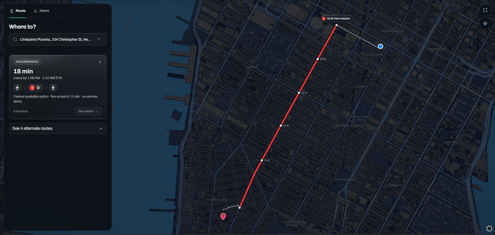
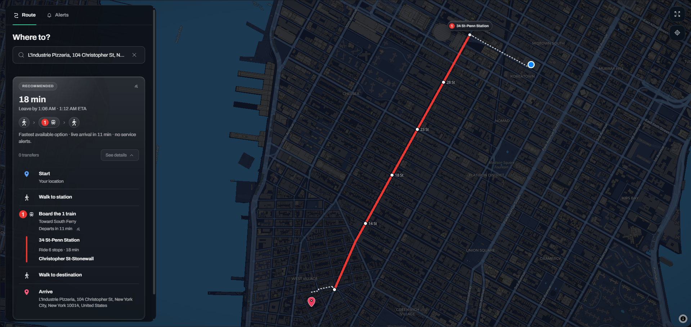
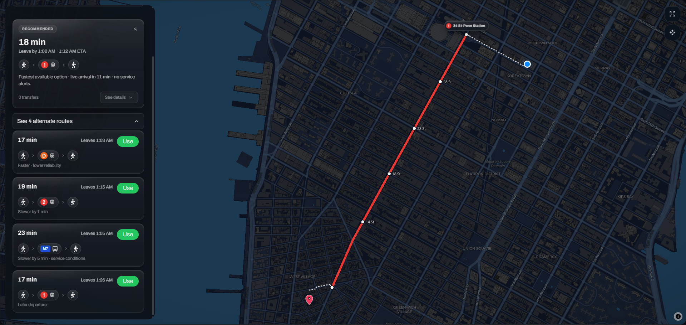
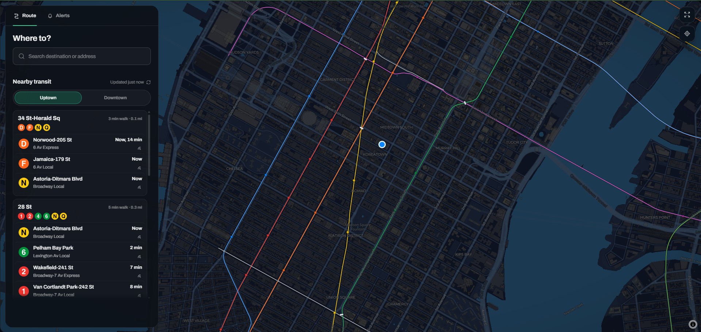
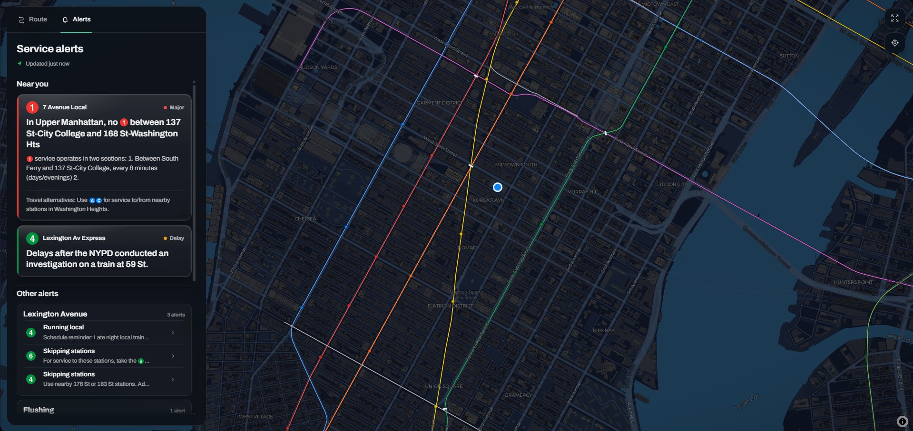

# SmartRoute

Real-time NYC transit routing with live alerts, vehicle context, and incident-aware recommendations.




> SmartRoute combines scheduled transit data, MTA realtime feeds, service alerts, incidents, and vehicle context to recommend subway routes with passenger-facing explanations.

## Overview

SmartRoute is a real-time NYC transit planning app built around live transit context.

Instead of only showing a static shortest path, SmartRoute compares route options against scheduled GTFS data, GTFS-RT arrivals and vehicle feeds, MTA service alerts, nearby incidents, and generated subway map artifacts. The result is a route recommendation that explains why a trip is better right now, not just why it is shortest on paper.

The app is intentionally product-first: a dark NYC map, a compact left rail, station-grouped arrivals, issue-first service alerts, and route details that are designed to feel like a serious transit app rather than a generic chatbot.

## At a Glance

| Area | Details |
|---|---|
| Product | NYC subway route planning, nearby transit, and service alert dashboard |
| Frontend | Next.js, React, TypeScript, Tailwind CSS, MapLibre GL, deck.gl |
| Backend | FastAPI, Python, PostgreSQL, WebSockets |
| Transit Data | GTFS, GTFS-RT, MTA service alerts, MTA BusTime SIRI |
| Route Intelligence | Live arrivals, service alerts, incidents, stalled vehicles, route ranking |
| Map Pipeline | Generated subway network, station anchors, validation checks |
| Deployment Shape | Frontend on Vercel, backend on Render-compatible FastAPI runtime |

## Features

- **Real-time subway route planning:** Compare transit routes using live arrivals, route details, walking legs, and transfer context.
- **Incident-aware recommendations:** Fold nearby incident scans, service alerts, and stalled vehicle context into route ranking.
- **Station-grouped nearby transit:** Show nearby stations as parent groups with route bullets, destinations, and grouped arrival times.
- **Compact bus support:** Keep bus rows visually distinct from subway bullets while preserving nearby transit context.
- **Issue-first service alerts:** Surface important nearby disruptions first, then group broader alerts by line family.
- **Interactive transit map:** Render the NYC subway network on a dark MapLibre map with route overlays, station labels, and endpoint markers.
- **Generated map artifacts:** Build subway visual network and station-anchor artifacts from deterministic scripts instead of hand-editing shipped geometry.
- **Secure live updates:** Mint short-lived, path-bound WebSocket tickets server-side so browser clients never receive the backend app key.

## Screenshots

### Route Planning


Planning a pizza run to L'Industrie Pizzeria with live route context, arrival timing, route alternatives, and a map preview.

### Route Details



Step-by-step route details pair official subway route bullets with walking, boarding, ride, and arrival steps.

### Alternate Routes



Alternates stay compact: riders can compare timing, reliability, transfers, and later departures without reading a wall of text.

### Nearby Transit



Nearby transit is grouped by station, with passenger-facing destinations, service patterns, walk distance, and live arrival times.

### Service Alerts



Service alerts are grouped around current issues and line families so riders can understand disruptions before opening details.

## Engineering Highlights

- **Static trip enrichment hot path:** Backend trip enrichment loads a precomputed stop-pattern index at startup, so route stop sequences do not depend on remote database lookups during the trip request path.
- **Async startup and feed handling:** Slow database initialization, GTFS refresh work, realtime cache warming, and GTFS-RT protobuf parsing are kept off the request-critical path with background tasks and thread offloading.
- **Route intelligence contract:** Route candidates, alerts, incidents, stalled trains, and stalled buses are normalized into a prompt contract that returns a selected route plus machine-readable candidate analysis.
- **Live feed architecture:** FastAPI serves nearby arrivals, vehicles, service alerts, and incident context over REST and WebSocket endpoints.
- **Path-bound WebSocket auth:** Next.js mints short-lived HMAC tickets tied to a specific WebSocket path; FastAPI verifies expiry, signature, and path before accepting a connection.
- **Display adapters:** The left rail renders normalized display models for nearby arrivals, service alerts, planning status, and route details instead of parsing raw backend fields inline.
- **Generated map pipeline:** Subway visual network, station anchors, route colors, and artifact manifests are generated and checked with TypeScript build scripts and runtime map checks.
- **Guard tests:** Focused tests protect passenger-facing invariants such as no fake nearby rows, no legacy public copy, grouped arrivals, alert grouping, and route detail text.

## Architecture

```text
MTA GTFS / GTFS-RT / Service Alerts / BusTime
                  |
                  v
          FastAPI Backend
  trips | live feed | alerts | vehicles | incidents
                  |
          REST + WebSocket APIs
                  |
                  v
          Next.js Frontend
  left rail | route planning | nearby transit | alerts
                  |
                  v
          MapLibre Transit Map

Offline Build Pipeline
  GTFS + OpenData geometry
        -> visual subway network
        -> station anchors
        -> artifact manifest
        -> validation checks
```

Route planning starts with transit candidates, enriches each option with static stop patterns and live context, then ranks the candidates into a recommended route and compact alternatives. The frontend renders the result as route cards, map overlays, endpoint markers, and detail steps.

## Tech Stack

**Frontend:** Next.js 16, React 19, TypeScript, Tailwind CSS, MapLibre GL, deck.gl, Motion

**Backend:** FastAPI, Python, Uvicorn, PostgreSQL, Redis-compatible cache fallback

**Transit Data:** MTA static GTFS, GTFS-RT feeds, MTA service alerts, MTA BusTime SIRI

**Route Intelligence:** Google Routes candidates, live transit context, incident scanning, route ranking, recommendation reasoning

**Build Tooling:** TypeScript build scripts, generated GeoJSON artifacts, station anchors, validation checks

**Testing:** TypeScript typecheck, ESLint, Node/tsx tests, Python unittest/pytest-compatible backend tests

## Running Locally

### Backend

```bash
cd backend
python -m venv .venv
```

Windows PowerShell:

```powershell
.\.venv\Scripts\Activate.ps1
pip install -r requirements.txt
uvicorn app.main:app --reload --host 0.0.0.0 --port 8000
```

macOS/Linux:

```bash
source .venv/bin/activate
pip install -r requirements.txt
uvicorn app.main:app --reload --host 0.0.0.0 --port 8000
```

The backend requires `APP_KEY` before startup. Add it to a local `.env` at the repository root or `backend/.env`.

### Frontend

```bash
cd frontend
npm install
npm run dev
```

Open `http://localhost:3000`. The frontend proxies API calls to `http://localhost:8000` when `API_URL` / `NEXT_PUBLIC_API_URL` are not configured.

## Environment Variables

Do not commit real secrets. Use local `.env` files and hosting provider environment settings.

| Variable | Used by | Required | Description |
|---|---|---:|---|
| `APP_KEY` | Frontend server routes + backend | Yes | Shared server-side secret for API proxy auth and signed WebSocket tickets. Never expose as `NEXT_PUBLIC_*`. |
| `API_URL` | Frontend server routes | Production | Server-side FastAPI base URL used by Next.js route handlers. |
| `NEXT_PUBLIC_API_URL` | Browser + frontend server fallback | Production | Public backend base URL when browser-visible clients need it. |
| `NEXT_PUBLIC_MAPTILER_API_KEY` | Frontend map | Yes for basemap | MapTiler key for map tiles and 3D building layers. |
| `NEXT_PUBLIC_MAPBOX_TOKEN` | Frontend search | Yes for destination search | Mapbox token for destination autocomplete and retrieval. |
| `GOOGLE_ROUTES_API_KEY` | Backend | Yes for trip planning | Google Routes API key for transit route candidates. |
| `ANTHROPIC_API_KEY` | Backend | Yes for hosted recommendation reasoning | Provider key used by the route recommendation service. |
| `SMARTROUTE_SYSTEM_PROMPT` | Backend | Optional | Preferred environment override for the route-ranking system prompt. |
| `SYSTEM_PROMPT` | Backend | Optional | Supported prompt override alias. |
| `ELEVENLABS_API_KEY` | Backend | Optional | Required only if text-to-speech is enabled. |
| `ENABLE_TTS` | Backend | Optional | Enables text-to-speech when set to `1`, `true`, or `yes`. |
| `DISABLE_TTS` | Backend | Optional | Legacy local toggle for disabling text-to-speech. |
| `XAI_API_KEY` | Backend | Optional | Enables external incident scanning when configured. |
| `MTA_BUS_API_KEY` | Backend | Optional for buses | MTA BusTime SIRI key for bus monitoring. |
| `DATABASE_URL` | Backend | Optional | PostgreSQL connection string for GTFS-related background/database paths. |
| `REDIS_URL` | Backend | Optional | Shared cache URL; backend falls back to in-memory cache when absent. |
| `CORS_ORIGIN_REGEX` | Backend | Optional | Regex for allowed preview origins. Production origin is configured in backend code. |
| `GTFS_DB_FALLBACK` | Backend | Optional | Enables a local GTFS fallback path when set to `1`. |
| `BACKEND_VERBOSE_LOGS` | Backend | Optional | Enables extra backend feed logs when set to `1`. |

Advanced tuning variables also exist for provider and trip-stage timeouts, including `GOOGLE_ROUTES_TIMEOUT_S`, `GOOGLE_ROUTES_RETRIES`, `GOOGLE_ROUTES_ALTERNATIVES`, `TRIP_CONTEXT_TIMEOUT_S`, `TRIP_ADVISOR_TIMEOUT_S`, `TRIP_TTS_TIMEOUT_S`, `TRIP_GTFS_ENRICH_TIMEOUT_S`, `TRIP_INCIDENT_SCAN_TIMEOUT_S`, and `DATABASE_STATEMENT_TIMEOUT_MS`.

## Project Structure

```text
backend/
  app/
    main.py              FastAPI app, CORS, startup lifecycle, API auth
    routers/             trip planning, live feed, service alerts, websocket routes
    services/            directions, route ranking, MTA feeds, incidents, buses, voice
    services/trips/      route candidate parsing, enrichment, incidents, scoring, text
    services/live_feed/  arrival, alert, vehicle, and incident feed shaping
    utils/               cache, GTFS static helpers, stop-pattern index
    data/                small checked-in runtime artifacts
  scripts/               backend GTFS artifact builders
  tests/                 backend unit and integration-style tests

frontend/
  app/                   Next.js routes, page shell, API proxy handlers
  components/map/        subway renderer, station overlays, route/map checks
  components/smart-route/
    left-rail/           route, nearby transit, and alert display adapters + views
    map/                 route preview map helpers and marker contracts
  lib/                   API clients, live-feed hooks, WebSocket ticket helpers
  scripts/build/         transit artifact generation and validation pipeline
  public/                generated runtime map artifacts

docs/
  assets/                checked-in product screenshots used by this README
```

Generated transit artifacts are sensitive. Do not hand-edit `frontend/public/subway-network.*.geojson`; regenerate them through the build scripts and review the diff.

## Validation

Primary frontend checks:

```bash
cd frontend
npm run typecheck
npm run test:unit
npm run lint
npm run verify:transit-artifacts
npm run build
```

Equivalent Windows-local binary commands used during development:

```powershell
cd frontend
.\node_modules\.bin\tsc.cmd --noEmit
.\node_modules\.bin\tsx.cmd --test lib/backend-proxy.test.mjs lib/ws-ticket.test.mjs lib/use-service-alerts.test.mjs components/smart-route/left-rail/alert-feed.test.mjs components/smart-route/left-rail/live-data.test.mjs components/smart-route/left-rail/hydration.test.mjs scripts/build/tests/station-anchors.test.ts
node components/map/subway-station-overlay.check.mjs
node components/map/subway-palette.check.mjs
node components/map/subway-renderer.check.mjs
```

Backend checks:

```bash
cd backend
python -m pytest -q
```

CI runs frontend artifact generation, typecheck, unit tests, lint, transit artifact verification, build, and backend pytest. Some local machines may need project dependencies installed before the full suite can run.

## Data Sources

SmartRoute uses public transit data and third-party routing/context providers:

- MTA static GTFS for scheduled subway structure.
- MTA GTFS-RT feeds for trip updates, vehicle positions, and service alerts.
- MTA BusTime SIRI for bus monitoring.
- NYC OpenData subway geometry for generated visual map artifacts.
- Google Routes for transit route candidates.
- External incident scanning when configured.

SmartRoute is not affiliated with or endorsed by the MTA.

## Known Limitations

- Realtime transit feeds can be incomplete, delayed, or temporarily unavailable.
- Route recommendations are advisory and should be checked against official MTA updates for high-stakes trips.
- Incident scanning depends on external provider availability and may miss or delay local events.
- Some map artifacts are optimized for readable display rather than canonical track geometry.
- Hosted AI, routing, search, and tile providers introduce quota and latency constraints.
- Full live rerouting would require more aggressive polling, push infrastructure, and provider cost management.

## Roadmap

- Mobile-first route planning flow with native-app-quality gestures.
- More precise live rerouting when service conditions change mid-trip.
- Better incident confidence scoring and source attribution.
- Expanded accessibility testing for map controls, rail navigation, and alert states.
- End-to-end route planning and service alert tests.
- Automated screenshot and demo capture for release reviews.
