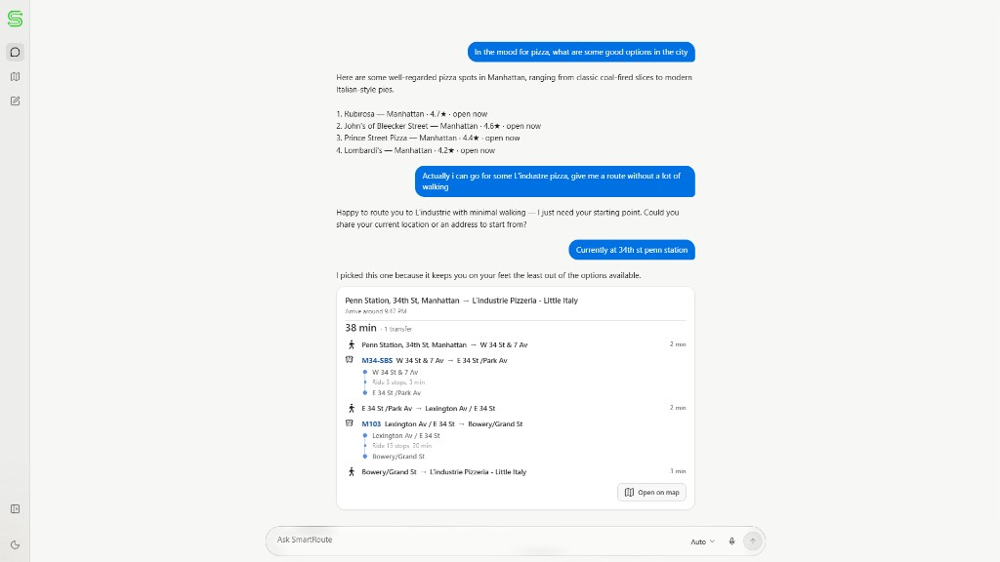
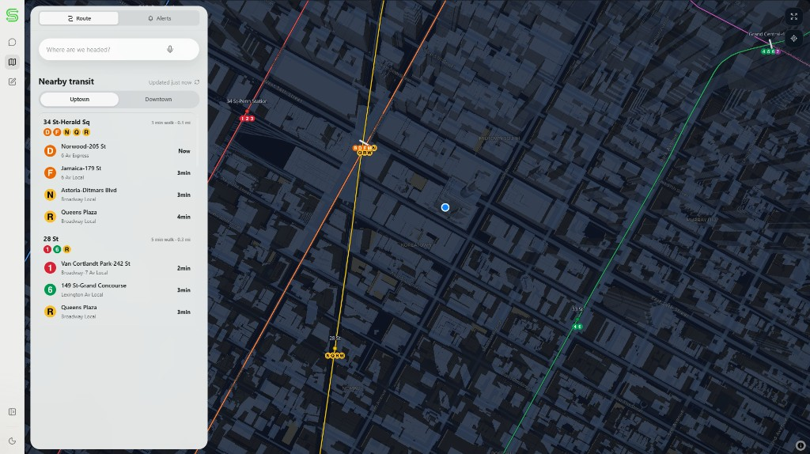
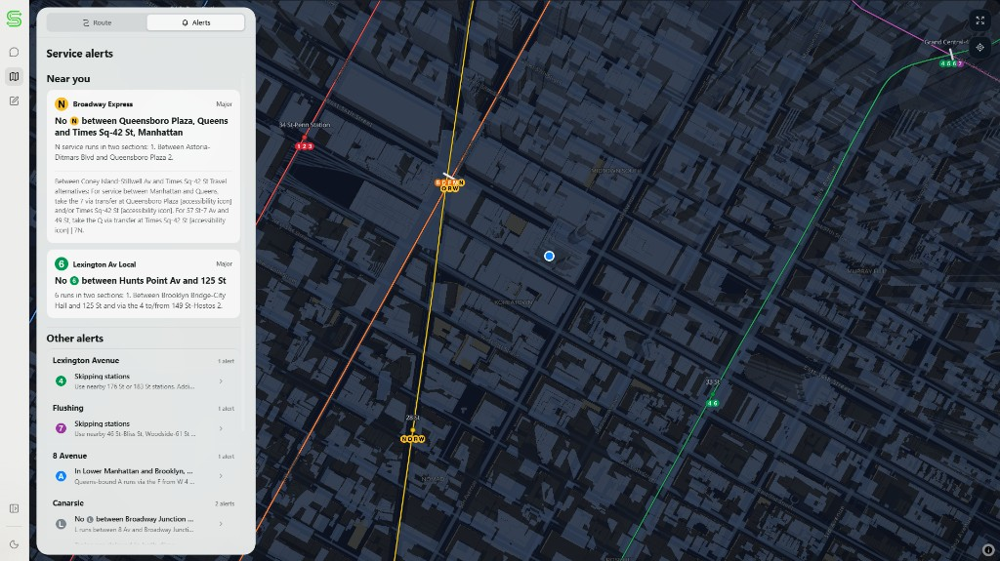

# SmartRoute

[Open SmartRoute](https://smartroute.fyi) to plan a trip, check arrivals, or view
current NYC transit conditions.

SmartRoute compares subway, bus, and walking options using scheduled service,
live MTA feeds, alerts, and nearby incidents. The Agent understands the request
and chooses among route options. The backend owns travel times, stops, transfers,
and the rules that decide whether a route can run.

<video src="docs/assets/smartroute-demo.mp4" width="100%" autoplay muted loop playsinline controls></video>

## How it works

1. The Agent interprets the rider's destination, preferences, and follow-up questions.
2. Backend services prepare route options and attach current service evidence.
3. The Agent chooses an option. The backend checks the choice and presents the
   stored trip in chat, directions, and the map.

If the Agent cannot make a valid choice, the backend selects a route using its
fallback ranking. Missing live evidence stays unknown.

The main engineering decisions are:

- Eight bounded capabilities keep provider calls and trip changes behind
  validated backend operations.
- Route comparison accounts for walking, transfers, accessibility, service
  changes, incidents, and event or crowd exposure.
- Redis stores chat sessions, admission state, and the shared incident index.
  A background job refreshes city incidents every 30 minutes, outside route requests.
- GTFS and MapLibre geometry are prepared before requests. Generated station
  anchors keep stops attached to the intended lines.
- REST, streamed chat events, and WebSocket updates carry the same backend trip
  facts to the frontend.

Read the [Agent pipeline](docs/agent-pipeline.md) for the chat flow or the
[backend architecture](backend/ARCHITECTURE.md) for service ownership.
The [documentation map](docs/README.md) links to contracts and release checks.

## Screenshots

| Chat | Transit map |
|---|---|
|  |  |

<details>
<summary>Service alerts</summary>



</details>

## Stack

- Frontend: Next.js 16, React 19, TypeScript 5.7, Tailwind CSS 4, MapLibre GL,
  Motion, Radix, and Zod.
- Backend: Python 3.12, FastAPI, Pydantic, and Redis-compatible storage.
- Data and services: MTA GTFS and realtime feeds, BusTime, Google Routes,
  Anthropic, xAI, and Ticketmaster.
- Deployment: Vercel frontend, Render-compatible FastAPI service, and a Render
  cron job for incident refresh.

## Run locally

Copy `.env.example` to a local `.env` and provide the services you want to use.
Never commit real keys. At minimum, the backend requires `APP_KEY`. Route
planning requires `GOOGLE_ROUTES_API_KEY`, and hosted chat requires
`ANTHROPIC_API_KEY`. Production chat and the incident cron require a shared
`REDIS_URL`.

Backend:

```powershell
cd backend
python -m venv .venv
.\.venv\Scripts\Activate.ps1
python -m pip install -r requirements.txt
python -m uvicorn app.main:app --reload --host 0.0.0.0 --port 8000
```

Frontend:

```powershell
cd frontend
npm install
npm run dev
```

Put frontend configuration in `frontend/.env.local`:

- `NEXT_PUBLIC_MAPBOX_TOKEN` enables predictive destination search.
- `API_URL` selects the backend for server-side proxy routes. Use
  `NEXT_PUBLIC_API_URL` only when browser code also needs the hosted URL.
- `NEXT_PUBLIC_MAPTILER_API_KEY` optionally enables 3D building tiles.

Open `http://localhost:3000`. The frontend uses `http://localhost:8000` by
default when no hosted backend URL is configured.

For local chat UI work without paid Agent or route-provider calls, set
`AGENT_MOCK_MODE=1` under an explicit local or test runtime profile. Production
startup rejects mock and fixture modes.

## Verification

Install the development dependencies, then run the same quality check used in
CI. Use the commit before your changes as the comparison point.

```bash
python -m pip install -r backend/requirements.txt -r backend/requirements-dev.txt
npm --prefix frontend ci
python scripts/check_quality.py --quality-ref <base-commit>
```

That command runs frontend coverage, backend tests with branch coverage, and
complexity regression checks. Existing baseline entries may not worsen.
CI also runs typechecking, ESLint, Oxlint, transit artifact checks, a production
build, browser release tests, and dependency scans. See
[release validation](docs/release-validation.md) for the individual commands.

Do not hand-edit generated subway GeoJSON. Use `npm run build:transit-artifacts`
from `frontend/` and inspect the result.

## Interface credits

SmartRoute includes or adapts interface work from these open-source projects:

- [Prompt Kit by ibelick](https://github.com/ibelick/prompt-kit), MIT license,
  for chat container, composer, message, suggestion, and scroll primitives.
- [Thinking Orbs by Jakub Antalik](https://github.com/Jakubantalik/thinking-orbs),
  MIT license, for the animated agent activity orb.
- [Vercel AI Elements](https://github.com/vercel/ai-elements), Apache-2.0
  license, for reasoning and shimmer foundations.
- [shadcn/ui](https://github.com/shadcn-ui/ui), MIT license, for accessible
  button, textarea, tooltip, and collapsible primitives.

These components are adapted to SmartRoute's own product behavior, transit
contracts, accessibility rules, and visual system. SmartRoute is not affiliated
with or endorsed by the MTA.
